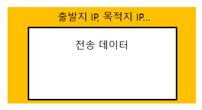
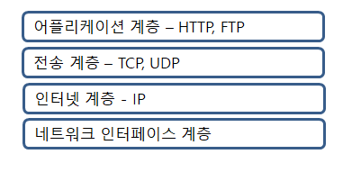
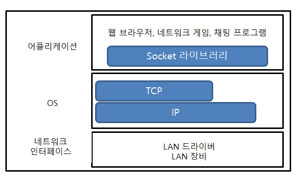
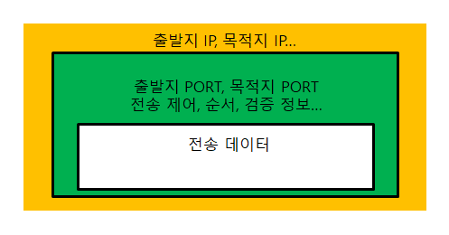
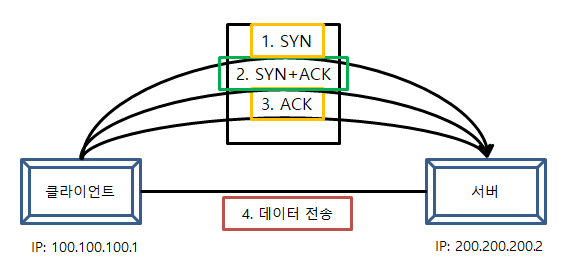

# 모든 개발자를 위한 HTTP 웹 기본 지식

이 글에서 정리한 내용은 모두 인프런의 `모든 개발자를 위한 HTTP 웹 기본 지식` 강의를 보고 정리한 글입니다.

## IP (Internet Protocol)

- 주역할은 지정한 `IP 주소`에 데이터를 전달한다.
- 데이터를 전달할 때 `패킷`이라는 통신 단위로 전달한다.



패킷 안에는 위와 같은 그림처럼 `출발지 IP`, `목적지 IP`와 전송 데이터를 가지고 있다.

클라이언트와 서버가 서로 통신할 때 서로 찾아가는 방식이 이 출발지 IP와 목적지 IP 정보를 가지고 찾아간다.

하지만 한계점이 있다.

- 비연결성
    - 서비스 불능 상태여도 패킷을 전송한다.
- 비신뢰성
    - 중간에 패킷이 사라지거나 패킷이 순서대로 오지 않으면 ?
- 프로그램 구분
    - 만약 서버에서 같은 IP를 사용하는 어플리케이션이 두 개 이상이면 ?
    - ex) 게임을 하면서 유튜브를 본다던지..
    

## TCP

IP 프로토콜의 한계점을 극복한 것이 바로 TCP 프로토콜이다.



먼저 위 그림은 `인터넷 프로토콜 스택의 4계층` 이다.

위 그림에서 보듯이 IP 프로토콜 위에 보완해서 나온 것이 전송 계층의 TCP 프로토콜 이다.



위 그림은 프로토콜 계층을 더 구체화한 그림이다.

자, 우리가 채팅을 한다고 가정해보자.

1. 먼저 프로그램은 전송할 메시지를 생성해서 OS 계층에다가 `Socket 라이브러리` 를 통해 전달한다.
2. OS 계층에서는 메시지에다가 TCP 정보와 IP 정보를 씌운다. 이는 결국 IP 패킷이 되는 것이다. 즉, IP 패킷 안에는 TCP, IP, 메시지 정보들이 모두 들어있다.
3. 마지막으로 네트워크 인터페이스인 LAN 카드를 통해서 `Ethernet frame`을 포함해서 나간다.
    
    
    
    
    - 위 그림에서 초록색 부분이 TCP 정보들이다.
    - IP와는 다르게 `출발지 PORT`, `목적지 PORT`와 전송제어, 순서, 검증과 관련된 정보들이 들어간다.
    
    ## TCP 특징
    
    전송 제어 프로토콜 (Transmission Control Protocol)
    
    - 연결지향 - TCP 3 way handshake (가상 연결)
        - 상대와 나랑 연결이 되었는지 확인한 후에 전송한다.
    - 데이터 전달 보증
        - 메시지를 보냈을 때 패킷이 중간에 누락되었는지 알 수 있다.
    - 순서 보장
    
    이러한 특징들 때문에 신뢰할 수 있는 프로토콜이라 한다.
    
    ## TCP 3 way handshake
    
    
    
    1. 먼저 `SYN`이라고 연결해달라고 서버에 던집니다.
    2. 서버는 클라이언트에 대한 `SYN`의 응답을 `ACK`로 보내고 역시나 서버도 연결해달라고  `SYN`도 같이 보냅니다.
    3. 그러면 클라이언트는 서버의 `SYN`에 대한 응답 `ACK` 를 보냅니다.
    4. 이렇게 연결이 잘 되고 나면 마지막으로 데이터를 전송합니다.
    
    만약 1, 2, 3번 과정중에 잘못되면 데이터를 전송하지 않는다.
    
    또한 TCP 3 way handshake는 물리적으로 연결이 된 것이 아니다.
    
    바로 논리적으로 연결되서 “아, 이 둘은 연결이 됐나보다” 하고 결정한다.
    

## UDP 특징

사용자 데이터그램 프로토콜 (User Datagram Protocol)

- 기능이 거의 없다.
- TCP 3 way handshake도 없다.
- 데이터 전달 보증하지도 않는다.
- 순서를 보장하지도 않는다.
- 하지만 명백한 장점은 단순하고 빠르다.

## PORT

만약 같은 IP에 여러 어플리케이션들을 돌린다면 이 어플리케이션들을 어떻게하면 구분할 수 있을까?

- 바로 PORT를 사용해서 구분한다.
- `출발지 PORT`와 `목적지 PORT`로 클라이언트와 서버가 통신한다.
- ex) 아파트가 IP면 아파트의 동이름(103호...)은 PORT
- 0 ~ 65535 할당 가능

## DNS

도메인 네임 시스템 (Domain Name System)

- 전화번호부 같은 개념
- 도메인명을 IP 주소로 변환

도메인 서버에서 도메인을 등록할 수 있다.

이렇게 등록하게 되면 중간에 IP가 변경되도 도메인명은 그대로 이므로 안전하다.

## URI (Uniform Resource Identifier)

URI는 로케이터(Locator), 이름(Name) 또는 둘 다 추가로 분류될 수 있다.

표준 스펙: [https://www.ietf.org/rfc/rfc3986.txt](https://www.ietf.org/rfc/rfc3986.txt)

URI (Resource Identifier) = URL (Resource Locator) + URN (Resource Name)

URI는 자원을 식별한다.

URL은 리소스의 위치 지정

URN은 리소스의 이름 부여

## 웹 브라우저 요청 흐름

```
https://www.naver.com
```

위 URL을 입력해서 엔터를 치면 어떤 일이 발생할까?

1. 먼저 DNS 서버를 조회해서 `naver`를 찾고 IP와 PORT 정보를 찾아낸다.
2. HTTP 요청 메시지를 생성해서 네이버 서버에 전송한다.
    1. 여기서 프로토콜 4계층의 전송 계층과 인터넷 계층에서 TCP/IP가 있는데 패킷에다 HTTP 요청 메시지 정보를 넣어준다.
    2. 즉, 전송 데이터에는 HTTP 요청 메시지 정보가 들어가게 된다.
3. 네이버 서버에서는 패킷을 까보고 HTTP 요청 메시지 정보를 해석한다.
    1. 그리고나서 HTTP 응답 메시지를 생성해서 클라이언트로 전송한다.
4. 클라이언트는 HTTP 응답 메시지를 해석해서 HTML이 렌더링된다.

## HTTP는 무상태 프로토콜이다.

스테이트리스(Stateless)

- 서버가 클라이언트의 상태를 보존하지 않는다.
- 장점: 서버 확장성이 높다 (스케일 아웃)
- 단점: 클라이언트가 추가 데이터를 전송한다.

스테이트리스 ↔ 스테이트풀 (Stateful, 상태 유지)

- 스테이트리스는 서버가 클라이언트의 상태를 보존하지 않는다라면 스테이트풀은 서버가 클라이언트의 상태를 보존한다 이다.
- 상태 유지는 항상 같은 서버가 유지되어야 한다. 그래서 클라이언트A가 서버1과 서로 통신한다고 가정하면 클라이언트A는 무조건 서버1 하고만 통신할 수 밖에 없다.
    - 여기서 만약 서버1이 에러가 난다면 어떻게 될까?
    - 그러면 클라이언트A는 처음부터 다시 요청을 해야한다. 이것이 상태 유지의 단점이다.
- 반면에 무상태(Stateless)는 아무 서버나 호출해도 된다.
    - 애초에 상태를 유지하지 않기 때문에 서버를 무한정으로 증식할 수 있는 것이죠.
    - 여기서 상태 유지와는 달리 서버1이 에러가 난다해도 서버2가 대신 수행할 수 있다.
    

### 무상태의 한계

하지만 모든 것을 무상태로 설계할 수는 없다.

예를 들어, 로그인 기능을 생각해보자.

로그인을 한 후에 다른 페이지를 요청하게 되면 무상태이므로 다시 로그인을 해야 하는 불편함이 있다.

- 그래서 나온 것이 세션, 쿠키이다.

무상태의 또 다른 단점은 데이터를 너무 많이 보낸다는 것이다.

## HTTP는 비연결성(Connectionless)이다.

기본적으로 `TCP/IP`는 연결지향이라는 특징이 있다.

반면에 `HTTP`는 기본적으로 연결을 유지하지 않는 비연결성이다.

또 한번 예를 들어보자.

- 먼저 클라이언트1이 서버A에 요청을 한다고 하면 서버는 그에 대한 응답을 해준다. 이렇게 하나의 통신이 계속 연결되어 있다.
- 그리고 이번엔 클라이언트2가 서버A에 요청하면 또 요청-응답을 하게 된다.
- 또 클라이언트3이 서버A에 요청하면 요청-응답을 하게 된다.

여기서 단점이 무엇일까?

```
클라이언트1, 2, 3이 요청한 통신이 계속 연결되어 있으므로 서버는 
계속적으로 자원을 소비할 수밖에 없게 된다. 
(심지어 한번 연결하고 더이상 요청하지 않는데도 말이다.)
```

---

이번에는 연결을 유지하지 않는 비연결성은 어떻게 될까?

- 클라이언트1이 요청하고 서버A가 응답하면 그 즉시 연결을 끊어버린다.
- 클라이언트2이 요청하고 서버A가 응답하면 그 즉시 연결을 끊어버린다.
- 클라이언트3이 요청하고 서버A가 응답하면 그 즉시 연결을 끊어버린다.

이러면 어떤 장점이 있을까?

```
요청-응답하고 연결을 바로 끊기 때문에 서버가 자원을 계속적으로 낭비하는
일이 없어진다. (즉, 서버의 부하를 줄일 수 있다.)
```

## HTTP 비연결성의 한계

- 만약 검색 요청을 하고 다시 또 다른 검색을 요청하게 되면 다시 TCP/IP 연결을 새로 맺어야 한다.
    - 이는 즉, tcp 3 way handshake 의 시간이 추가된다.
- 웹 브라우저를 요청하게 되면 html 뿐만 아니라 css, image 등등 수많은 리소스를 다운받게 된다.
    - 그러면 이 많은 리소스들을 매번 다운로드 받아야하는가?
    - 이거에 대한 해결법이 HTTP 지속 연결(Persistent Connections)로 문제를 해결했다.

```
Persistent Connections의 원리
기본적으로 http를 사용하면 매 요청마다 연결하고 리소스 다운받고 종료를 
날린다. (곱하기)
하지만 Persistent Connections를 적용하게 되면 한번 연결하고 요청-응답을 
받고 연결을 유지한다. 그런 다음에 리소스를 다운받고 한번 종료를 한다.
```

## 스테이트리스를 기억하자!!

서버 개발자들이 어려워하는 업무

- 이를 해결하려면 최대한 스테이트리스하게 설계를 해야한다.
- 그래야 서버를 증식할 수 있도록 대응할 수 있다.

## HTTP 메서드의 속성

### 안전 (Safe)

- GET 메소드 빼고는 나머지는 안전하지 않다.
- 즉, 메소드를 호출해도 변하지 않는 것이 안전하다는 뜻이다.

### 멱등 (Idempotent)

- 한번 호출하든 두번 호출하든 100번 호출하든 결과가 똑같다.
- GET: 한번 조회하든, 두번 조회하든 같은 결과가 조회된다.
- PUT: PUT 메소드는 기존꺼를 날리고 덮어버리는 특징이 있는데 이 특징 때문에 PUT은 멱등 메서드가 된다. 즉, 처음 PUT한 경우와 두번째로 또 PUT 했을 때 최종적으로 결과물은 똑같다.
- DELETE: 같은 요청을 여러번 해도 삭제된 결과는 같다.
- POST: POST 메서드는 멱등이 아니다! 같은 요청을 두번 호출하면 같은 결제가 중복해서 발생할 수 있다.

그렇다면 이러한 멱등 개념이 왜 필요할까?

- 자동 복구 메커니즘에 활용한다.
- 서버가 TIMEOUT 등으로 정상 응답을 못주었을 떄, 클라이언트가 같은 요청을 다시 해도 되는가? - 판단, 근거가 된다.

다시 한번 예를 들어보자.

만약 DELETE를 했을 때 서버가 응답이 없어서 DELETE가 잘되었는지 모른다. 그래서 클라이언트가 다시 DELETE 요청을 하게 되면 어떨까? - 이는 멱등하기 때문이다.

### 캐시가능 (Cacheable)

GET, HEAD, POST, PATCH 메서드는 캐시가 가능하지만 실제로는 GET, HEAD 정도만 캐시로 사용한다.

## 클라이언트에서 서버로 데이터 전송

### 데이터 전달 방식은 크게 2가지

- 쿼리 파라미터를 통한 데이터 전송
    - GET
    - 주로 정렬 필터 (검색어)
- 메시지 바디를 통한 데이터 전송
    - POST, PUT, PATCH
    - 회원가입, 상품주문, 리소스 등록, 리소스 변경
    

## PUT VS PATCH

PUT은 기존의 것을 없애고 완전히 덮어버리기 때문에 왠만하면 쓰지 않는 것이 좋다.

PATCH는 기존의 것을 그대로 두고 수정할 부분만 수정한다.

- 그렇다면 PATCH와 PUT 각각 언제 사용하는 것이 좋은가?
- PATCH
    - 예를 들어, 회원 수정할 때는 PATCH를 사용하는 것이 좋다.
    - 만약 회원 수정을 PUT을 사용한다고 가정하자. 그러면 PUT은 기존의 것을 완전히 없앤다고 했다. 아래 JSON을 한번 봐보자.

```json
{
	"name": "철수",
	"age": 30
}
```

기존에 이러한 데이터가 있는데 회원 수정(PUT 메서드)을 해서 `age`만 변경한다고 하면 JSON 데이터는 어떻게 될까?

```json
{
	"age": 30
}
```

보면 `name`이 사라진 것을 볼 수 있다.

즉, `age`만 수정했는데 `name`이 날라가버린 상황이다.

즉, 중요한 데이터를 수정할때는 무조건 PATCH를 사용하거나 아니면 그냥 POST를 사용하자

(POST는 만능이다.)

- PUT
    - PUT은 게시글을 수정할 때 사용하는 것이 좋겠다.

보통 게시판의 경우 수정할 때는 게시글만 수정하는 경우가 있다. 그래서 이 같은 경우는 기존의 것을 없애고 완전히 덮어버릴 수가 있다.

따라서 이 때는 PUT을 사용한다. 또한 파일 등록할 때도 PUT을 사용한다.

## POST - 신규 자원 등록 특징 (회원)

클라이언트는 등록될 리소스의 URI를 모른다.

- 회원 등록 /members → POST

서버는 새로 등록될 리소스의 URI를 생성해준다.

```json
HTTP/1.1 201 Created
Location: /members/100
```

이처럼 서버가 리소스의 URI를 생성하고 관리하는 것을 `컬렉션` 이라고 부른다.

여기서 컬렉션은 `/members` 이다.

## PUT - 신규 자원 등록 특징 (파일)

클라이언트는 리소스 URI를 알고 있어야 한다.

- 파일 등록 /files/{filename} → PUT

이 경우 클라이언트가 직접 리소스의 URI를 지정한다.

이처럼 클라이언트가 리소스의 URI를 알고 관리하는 것을 `스토어` 라고 부른다.

여기서 스토어는 `/files` 이다.

자 지금까지 POST와 PUT 의 신규 등록에 대해 알아보았다.

### 🚩 이제 정리해보자.

**POST로 신규 데이터를 등록한다는 것은 클라이언트가 서버에 요청하는 것이다. 그러면 서버는 알아서 리소스를 생성한다.**

**반면에 PUT 기반 등록은 클라이언트가 리소스의 URI를 알고 등록한다.**

**이미지를 생각해보자. 이미지는 클라이언트가 리소스의 URI를 알고 있다.**

## URI 설계시 주의 & 좋은 URI 설계

참고: https://restfulapi.net/resource-naming

- 회원 등록 폼 URI(GET)와 회원 등록 URI(POST)는 서로 맞추는 것이 좋다.
- 수정도 마찬가지다.
- 문서(document)
    - 단일 개념(파일 하나, 객체 인스턴스, 데이터베이스 row)
    - 예) /members/100, /files/star.jpg
- 컬렉션(collection)
    - 서버가 리소스의 URI를 생성하고 관리
    - 예)
- 스토어(store)
    - 클라이언트가 리소스의 URI를 알고 관리
    - 예) /files
- 컨트롤러(controller), 컨트롤 URI
    - 문서, 컬렉션, 스토어로 해결하기 어려운 추가 프로세스 실행
    - 동사를 직접 사용
    - 예) /members/{id}/delete

## 쿠키

- Set-Cookie: 서버에서 클라이언트로 쿠키 전달 (응답)
- Cookie: 클라이언트가 서버에서 받은 쿠키를 저장하고, HTTP 요청시 서버로 전달

웹 브라우저에는 쿠키 저장소가 있는데 서버가 보낸 쿠키를 이 쿠키 저장소에 저장한다.

그리고 HTTP 헤더에 Cookie를 만들고 값을 쿠키 저장소에서 꺼내서 서버에 보낸다.

## cache-control

캐시를 적용하게 되면 HTTP 헤더에 `cache-control: max-age=60` 이 생긴다.

이 때 max-age는 캐시의 유효 시간이다.

그래서 유효시간이 끝나면 당연히 브라우저 캐시에 캐시가 사라지고 서버에서 다시 다운을 받는다.

여기서 잘 생각해보면 만약에 `star.jpg` 라는 것을 처음에 서버에서 다운받고 브라우저 캐시에 저장되어 있다고 가정하자.

그리고 `max-age=60`에 의해 유효시간도 다되어서 클라이언트가 다시 똑같은 `star.jpg`를 요청했을 때 또 다운을 받아야 하는가?

자, **캐시 유효시간이 초과되면** 다음과 같은 두 가지 경우가 나타난다.

1. 서버에서 기존 데이터를 변경함 star.jpg → star1.jpg
2. 서버에서 기존 데이터를 변경하지 않음 star.jpg

이런 경우에는 클라이언트의 데이터와 서버의 데이터가 같다는 사실을 확인할 수 있는 방법이 필요하다.

→ 그래서 해결 방안으로 **검증 헤더가 추가**되었다.

```
Last-Modified: 2020년 11월 11일 10:00:00
```

`Last-Modified` : 마지막으로 수정된 날짜 추가!

이 Last-Modified를 브라우저 캐시에 추가한다.

여기서 만약 캐시 유효시간이 초과되면,

먼저 헤더에 `Last-Modified`를 확인한다.

있으면 클라이언트는 서버에 요청할 때 아래와 같이 요청 메시지를 보낸다.

```
if-modified-since: 2020년 11월 10일 10:00:00
```

그러면 서버에서 `if-modified-since`를 확인해서 날짜를 서로 비교해서 변경이 되었는지 안되었는지 확인한다.

**여기서 중요한 것은 변경된 것이 없다면 서버에서 응답 메시지를 보낼 때 상태코드를 `304 Not Modified` 를 보낸다. (이 때 HTTP Body가 없다.)**

HTTP Body를 빼고 보내므로 속도도 빨라진다.